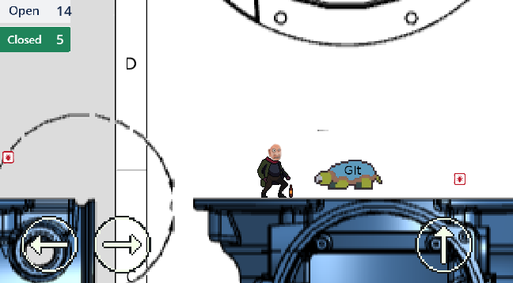

# Patch Jumper

> **You are a frazzled engineer on the run!**
>
> - **Dash through a field of bugs**
> - **Snag fixes**
> - **Dodge conflicts**
> - **Don’t lose your `HEAD`**
> - **Push the build before the deadline!**

---

## ⚡ About

This game was thrown together in Godot during a chaotic **60-minute coding sprint** on a Saturday—right after a teammate *literally* lost their `HEAD` in a bad merge and got hilariously (and tragically) upset.

---

## 🎮 Controls

- **Arrow keys** — Move left, right and jump
- **Spacebar** — Jump

---

## 🚨 Disclaimers

- **Any resemblance to real CAD tools, software, or engineering trauma is entirely your imagination. 😉**
- **This code is a tangled mess of hacks and shortcuts.**
  _Do not_ use as a reference for real-world projects!
  Unless you want your manager to lose their `HEAD`, too… 😅

---

## 🛠️ Dev Note

_All the CAD tools I’ve ever built (or broken) live on in my heart._
**Happy patching!**
